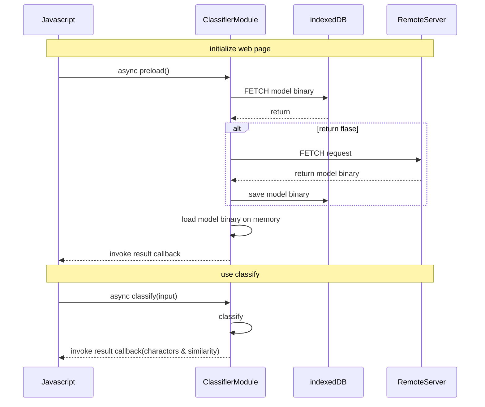

# zinnia-demo

## Requirement
- ruby 2.2.0
- rails 4.1.7
- zinnia-0.0.6
## Zinnia
### Download
https://sourceforge.net/projects/zinnia/files/

### Installation

```
cd zinnia-0.0.6/ruby
ruby extconf.rb
make
make install
```
## Tomoe
### Download
https://sourceforge.net/projects/zinnia/files/

### Create model files
```
cd zinnia-tomoe-0.6.0-20080911
./configure
make
make install
```
## Alphabet, katakana, arabic_numeric 
### Download
https://github.com/adokoy001/HWR-Learning-Data-Sets
### Create model files (Require zinnia-learn)

```
zinnia-learn  learn_arabic_numeric.s arabic_numeric.model
zinnia_learn learn_alphabet.s alphabet.model
zinnia_learn learned_katakana.s katakana.model
```

## Model files URL

- Handwriting-JA: https://zinnia-demo.s3-ap-northeast-1.amazonaws.com/handwriting-ja.model
- Handwriting-CN: https://zinnia-demo.s3-ap-northeast-1.amazonaws.com/handwriting-zh_CN.model
- Alphabet: https://zinnia-demo.s3-ap-northeast-1.amazonaws.com/alphabet.model
- Katakana: https://zinnia-demo.s3-ap-northeast-1.amazonaws.com/katakana.model
- Numeric: https://zinnia-demo.s3-ap-northeast-1.amazonaws.com/arabic_numeric.model

## APIs
- home/top (GET)
- home/classify (GET)

## Demo


# WASM build

## Requirement

- emscripten
https://emscripten.org/docs/getting_started/downloads.html

## Build

### Input
- https://github.com/aHungNguyenKhanh/zinnia-demo/blob/main/lib/classifier.cpp

### 
```
cp zinnia-demo/libs/
em++ --bind -lidbfs.js -o classifier.html -s WASM=1 -s FETCH=1 -s tests/classifier.cpp recognizer.o character.o libzinnia.o param.o feature.o sexp.o svm.o trainer.o -s EXPORT_NAME="'Classifier'" -s ALLOW_MEMORY_GROWTH=1
```

### Output

- classifier.js
- classifier.wasm

## WebAssembly module

### Functions
- preload(Url, callback(success){}) //Load model file from remote server to indexedDB 
  - Parameter: 
    - Url: model file URL(from remote server)
    - callback function:
      - parameters:
        - success: Boolean
  - Return: 
    
- classify(input, items_count, callback(success, result){}) // get saved model file from indexedDB then classify the input and print result.
  - Parameters:
    - input: formated handwriting strokes. Example: "(character (width 1000)(height 1000)(strokes ((243 273)(393 450))((700 253)(343 486)(280 716)(393 866)(710 880))))"
    - items_count: number of returned items 
    - callback function:
      - parameters:
        - success: Boolean
        - result: A Json like string. Example: {"あ": "0.8923", "い": "0.342", "う": "0.5462", "え":"0.234", "お": "0.456"}
  - Return:

### Import module

```
<script async type="text/javascript" src="classifier.js"></script>
```

### Use

```
Classifier.preload(function callback(success) {
  if(success == true) {
    // TODO
  } else {
    // TODO
  }
});
```

```
Classifier.classify("input strokes", items_count, function callback(success, result) {
  if(success == true) {
    // var json_result = JSON.parse(result);
  } else {
    // TODO
  }
});
```
## Sequence

