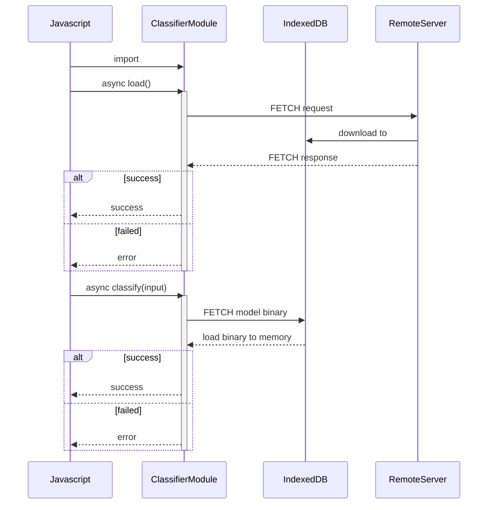

# zinnia-demo

## Requirement
- ruby 2.2.0
- rails 4.1.7
- zinnia-0.0.6
- zinnia-tomoe-0.6.0

## Zinnia

### Download
https://sourceforge.net/projects/zinnia/files/

### Installation

```
cd zinnia-0.0.6/ruby
ruby extconf.rb
make
make install
```

```
cd zinnia-tomoe-0.6.0-20080911
./configure
make
make install
```

## APIs
- home/top (GET)
- home/classify (GET)

## Demo


# WASM build

## Requirement

- emscripten
https://emscripten.org/docs/getting_started/downloads.html

## Build

### Input
- https://github.com/aHungNguyenKhanh/zinnia-demo/blob/main/lib/classifier.cpp

### 
```
cp zinnia-demo/libs/
em++ --bind -lidbfs.js -o classifier.html -s WASM=1 -s FETCH=1 -s tests/classifier.cpp recognizer.o character.o libzinnia.o param.o feature.o sexp.o svm.o trainer.o -s EXPORT_NAME="'Classifier'" -s ALLOW_MEMORY_GROWTH=1
```

### Output

- classifier.js
- classifier.wasm

## WebAssembly module

### Functions
- preload() //Load model file from remote server to indexedDB 
  - Parameter:
  - Return: 
    
- classify(input) // get saved model file from indexedDB then classify the input and print result.
  - Parameter:
    - input: formated handwriting strokes. Example: "(character (width 1000)(height 1000)(strokes ((243 273)(393 450))((700 253)(343 486)(280 716)(393 866)(710 880))))"
  - Return:

### Import module

```
<script async type="text/javascript" src="classifier.js"></script>
```

### Use

```
Classifier.preload();
```

```
Classifier.classify("input");
```
## Sequence


